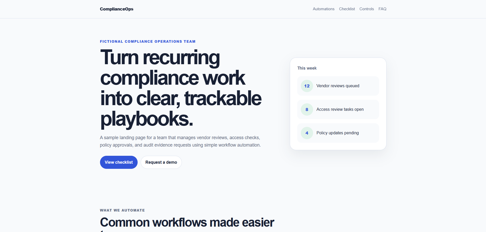
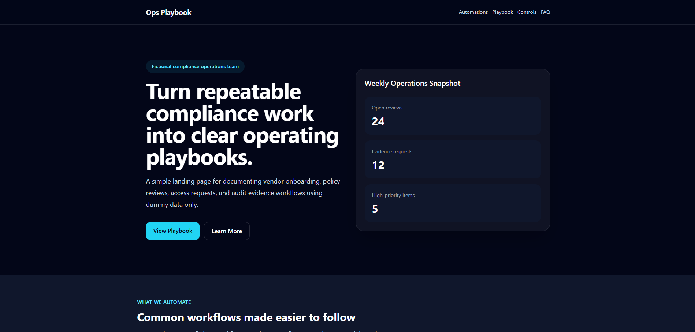

# Mini Project 1 — Operations Playbook Landing Site

A responsive landing page for a fictional compliance operations team, built with semantic HTML, Tailwind CSS, Vite, and accessibility-friendly design patterns.

## Live Demo

- Live site: https://fullstack-ai-course-nine.vercel.app/
- GitHub repository: https://github.com/markjosephdomocol-web/fullstack-ai-course

## Project Purpose

This project is part of my Full Stack AI Learning Program.

The goal was to practice frontend fundamentals by first building the page with semantic HTML and traditional CSS, then rebuilding and improving it with Tailwind CSS.

The project also introduced Vite, responsive utility classes, production builds, GitHub version control, and deployment with Vercel.

The page represents a fictional compliance operations team and uses dummy data only.

## Features

- Semantic HTML structure
- Responsive navigation
- Mobile-first layout
- Hero section
- Weekly operations summary
- Workflow automation cards
- Compliance Operations Playbook section
- Vendor onboarding checklist
- Policy review checklist
- Access request checklist
- Audit evidence checklist
- Sample control cards
- FAQ section
- Call-to-action section
- Hover and keyboard focus states
- Responsive layouts using Tailwind breakpoints
- Live deployment through Vercel

## Tech Stack

- HTML
- Tailwind CSS
- Vite
- JavaScript module entry point
- Git
- GitHub
- Vercel

## Screenshots

### Week 2 — HTML and CSS Version



### Week 3 — Tailwind and Deployed Version



## How to Run Locally

Open a terminal and move into the Mini Project 1 folder:

```bash
cd mini-project-1
```

Install the project dependencies:

```bash
npm install
```

Start the Vite development server:

```bash
npm run dev
```

Open the local address shown by Vite, usually:

```txt
http://localhost:5173
```

## How to Build

Create a production build:

```bash
npm run build
```

Preview the production build locally:

```bash
npm run preview
```

The production files are generated inside the `dist` folder.

## What I Learned

- How to structure a page with semantic HTML
- How to use `header`, `nav`, `main`, `section`, `article`, `aside`, and `footer`
- How Tailwind utility classes represent individual CSS decisions
- How to use Tailwind spacing, typography, colors, borders, and layout utilities
- How responsive prefixes such as `md:` and `lg:` work
- How to create reusable card, badge, and button patterns
- How to build a mobile-first responsive layout
- Why hover and keyboard focus states matter
- How Vite runs a development server and creates a production build
- How to configure the correct project root for deployment
- How to deploy a Vite project through Vercel
- How to debug missing files and deployment build errors

## Week 3 Checkpoint Answers

### 1. What problem does Tailwind solve?

Tailwind helps me style a page faster by using small utility classes directly in the HTML.

Instead of writing a separate custom CSS rule for every spacing, color, layout, and typography decision, I can use classes such as `p-6`, `bg-white`, `rounded-2xl`, `grid`, and `text-lg`.

It also helps keep the design consistent because I can reuse the same spacing, colors, cards, buttons, and responsive patterns throughout the site.

### 2. How do responsive prefixes like `md:` and `lg:` work?

Responsive prefixes apply styles starting at specific screen sizes. Classes without prefixes are the default styles and normally represent the mobile layout.

For example:

```html
<div class="grid grid-cols-1 md:grid-cols-2 lg:grid-cols-4">
```

This means:

- Small screens: one column
- Medium screens and larger: two columns
- Large screens and larger: four columns

This supports a mobile-first approach because the simplest layout is defined first, followed by changes for larger screens.

### 3. How would you make a button visually consistent across the site?

I would reuse the same base utility classes for padding, rounded corners, font weight, hover behavior, and keyboard focus states.

For example:

```html
class="rounded-xl px-5 py-3 font-semibold focus:outline-none focus:ring-2"
```

I could then change only the colors depending on whether the button is primary or secondary.

### 4. What should be included in a good project README?

A good README should include:

- Project name and description
- Project purpose
- Live demo link
- Screenshots
- Main features
- Tech stack
- Local setup instructions
- Build instructions
- What I learned
- Known limitations
- Data safety information when relevant

A README should allow someone to understand the project without first reading all the source code.

### 5. What changed from the Week 2 CSS version to the Week 3 Tailwind version?

In Week 2, the site used semantic HTML and traditional CSS.

In Week 3, I converted the project into a Vite and Tailwind CSS setup. Much of the styling moved from separate CSS rules into Tailwind utility classes inside the HTML.

I also added:

- More consistent cards and buttons
- Responsive navigation
- A Compliance Operations Playbook section
- More checklist content
- Improved spacing and typography
- Responsive Tailwind breakpoints
- A production build process
- Live deployment through Vercel

### 6. What part of Tailwind felt confusing at first?

The most confusing part was understanding the long list of utility classes placed on a single HTML element.

At first, the classes looked difficult to read. They became easier to understand when I separated them mentally into categories:

- Layout
- Spacing
- Color
- Typography
- Border
- Responsive behavior
- Hover behavior
- Keyboard focus behavior

I also learned that Tailwind does not replace CSS knowledge. It provides shorter utility classes for applying CSS concepts.

### 7. Is the site deployed and linked in the README?

Yes. The site is deployed through Vercel and linked near the top of this README.

Live site:

https://fullstack-ai-course-nine.vercel.app/

## Data Safety

This project uses fictional and sample data only.

It does not include real:

- Company policies
- Client or customer data
- Security evidence
- Credentials
- HR records
- Contracts
- Financial information
- Audit findings
- Confidential workflows

## Known Limitations

- The page is currently static
- No form submission is implemented
- No dynamic JavaScript functionality is included yet
- No backend or database is connected
- All content is fictional